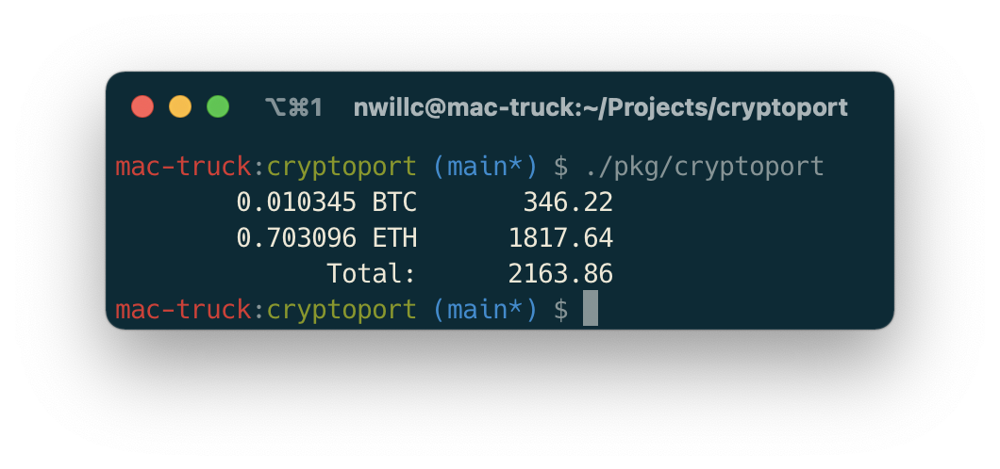

# cryptoport
cli crypto portfolio 

Cli that produces output like:


## Build

```shell
go build .
```

## Use
### Help
```shell
$ cryptoport -h
A simple crypto portfolio status cli that reports the value of your portfolio

Usage:
  cryptoport [flags]
  cryptoport [command]

Available Commands:
  help        Help about any command
  setup       Setup your portfolio configuration.
  version     Print the version number

Flags:
  -h, --help   help for cryptoport
```

1. Have your Nomics API key and holdings info ready. Setup your configuration:
```shell
$ cryptoport setup
```
1. Run...
```shell
$ cryptoport
```

## TODO
- timestamp & deltas?
